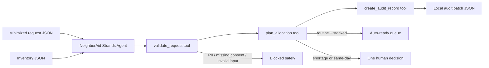

# Architecture

Trust boundaries:

- Input is local JSON; direct names, email, phone and address are rejected.
- Inventory changes happen only in the in-memory simulation and output file.
- No email, booking, purchase, reservation or other external action is performed.
- The three operational functions are registered as Strands Agent tools and executed through `agent.tool`.
